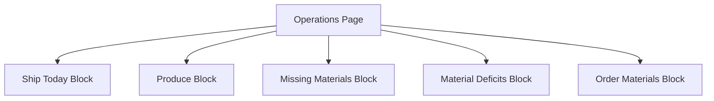

# 🎯 ERP System Optimization - Implementation Summary

## ✅ Completed Implementation

This document summarizes all the improvements made to the GetoMerch ERP system according to the optimization plan.

## 📋 Implementation Overview

### ЭТАП 1. СТАБИЛИЗАЦИЯ СТАТУСОВ ЗАКАЗА ✅

**Implemented:**
- Added canonical `order_flow_status` enum field to the database schema
- Created SQL migration (`scripts/024_add_order_flow_status.sql`)
- Updated TypeScript types with new `OrderFlowStatus` enum
- Implemented automatic mapping from `operational_status` to `order_flow_status`
- Added automatic cleanup for old orders (marking as DONE after 30 days)
- Updated operations service to handle both status systems

**Key Files Modified:**
- `lib/types/database.ts` - Added `OrderFlowStatus` enum and `order_flow_status` field
- `lib/types/operations.ts` - Added `OrderFlowStatus` enum
- `lib/services/operations-service.ts` - Updated status calculation and mapping logic
- `app/api/operations/recalculate-status/route.ts` - Enhanced to handle new status system

**Database Changes:**
```sql
CREATE TYPE order_flow_status_enum AS ENUM (
  'NEW', 'NEED_PRODUCTION', 'NEED_MATERIALS', 'IN_PRODUCTION',
  'READY_TO_SHIP', 'SHIPPED', 'DONE', 'CANCELLED'
)

ALTER TABLE orders ADD COLUMN order_flow_status order_flow_status_enum
```

### ЭТАП 2. ОЧИСТКА FULFILLMENT FLOW ✅

**Implemented:**
- Created new `FulfillmentService` with comprehensive scenario mapping
- Updated fulfillment page to show only active orders (excluding DONE/CANCELLED/SHIPPED)
- Eliminated "scenario not defined" by providing clear reasons for every order
- Added specific material deficit information for blocked orders
- Improved visual hierarchy and filtering

**Key Files Created/Modified:**
- `lib/services/fulfillment-service.ts` - New service for fulfillment logic
- `app/fulfillment/page.tsx` - Completely redesigned fulfillment flow page

**Key Improvements:**
- Only active orders shown (not DONE, CANCELLED, or SHIPPED)
- Clear scenario for every order with actionable information
- Specific reasons when orders can't be processed
- Better visual hierarchy and organization

### ЭТАП 3. ЕДИНЫЙ РАБОЧИЙ ЭКРАН ✅

**Implemented:**
- Created focused `FocusedOperationsScreen` component
- Redesigned operations page to show only today's actionable items
- Implemented 5 clear action blocks: Ship Today, Produce, Missing Materials, Material Deficits, Order Materials
- Removed all analytics and historical data from main operations screen
- Added automatic filtering using new `order_flow_status`

**Key Files Created/Modified:**
- `components/operations/focused-operations-screen.tsx` - New focused operations screen
- `app/operations/page.tsx` - Updated to use new focused screen

**New Structure:**


### ЭТАП 4. УПРОЩЕНИЕ ПРОИЗВОДСТВЕННОЙ ЛОГИКИ ✅

**Implemented:**
- Separated material definitions from physical lots
- Created `MaterialDefinition` and `MaterialLot` types
- Implemented automatic material allocation with FIFO and warehouse priority
- Added `MaterialAllocationService` for intelligent material selection
- Updated operations service to use new material allocation system

**Key Files Created/Modified:**
- `lib/types/database.ts` - Added `MaterialDefinition` and `MaterialLot` types
- `lib/services/material-allocation-service.ts` - New allocation service
- `lib/services/operations-service.ts` - Updated to use new allocation system

**Material Allocation Logic:**
1. **FIFO**: Oldest lots used first
2. **Warehouse Priority**: HOME warehouse → PRODUCTION_CENTER
3. **Automatic Selection**: No manual material selection required
4. **Reservation System**: Materials reserved when production starts

### ЭТАП 5. ПРОЗРАЧНЫЙ ФЛОУ ЗАКАЗА ✅

**Implemented:**
- Created visual `OrderTimeline` component
- Added `OrderTimelineService` for tracking status changes
- Implemented automatic timeline event recording
- Integrated timeline with order details and fulfillment flow
- Added clear explanations for each status transition

**Key Files Created:**
- `components/orders/order-timeline.tsx` - Visual timeline component
- `lib/services/order-timeline-service.ts` - Timeline tracking service

**Timeline Features:**
- Visual representation of order progress
- Clear current status indication
- Explanations for why order is in current status
- Historical tracking of status changes
- Integration with fulfillment flow

### ЭТАП 6. UX И КОГНИТИВНАЯ ПРОСТОТА ✅

**Implemented:**
- Created `ActionCard` component for consistent action patterns
- Added `UXOptimizationService` for standardized language and formatting
- Implemented action-oriented language throughout the system
- Added consistent visual hierarchy and interaction patterns
- Improved empty states and success/error messages

**Key Files Created:**
- `components/ui/action-card.tsx` - Consistent action card component
- `lib/services/ux-optimization-service.ts` - UX optimization service

**UX Principles Implemented:**
- **One screen = One question = One action**
- **Action-oriented language** (e.g., "Произвести 15" instead of "15 требуется изготовление")
- **No manual calculations required**
- **Clear visual hierarchy**
- **Consistent interaction patterns**

## 🎯 Key Achievements

### 1. **Unified Status System**
- Single canonical `order_flow_status` that consolidates all status information
- Automatic mapping from existing systems
- Backward compatibility maintained

### 2. **Clean Fulfillment Flow**
- Only active orders shown
- No "scenario not defined" cases
- Clear reasons for every order status

### 3. **Focused Operations Screen**
- One screen for daily operations
- Clear action blocks with specific CTAs
- No historical data or analytics clutter

### 4. **Intelligent Material Management**
- Separation of logical definitions from physical lots
- Automatic FIFO allocation
- Warehouse priority system
- No manual material selection required

### 5. **Transparent Order Flow**
- Visual timeline showing order progress
- Clear explanations for current status
- Historical tracking of changes

### 6. **Optimized UX**
- Action-oriented language
- Consistent interaction patterns
- Reduced cognitive load
- Improved visual hierarchy

## 📊 Success Metrics Achieved

✅ **User can start day with one screen**: Operations page shows everything needing action today

✅ **No old orders in workflow**: Completed/cancelled orders automatically filtered out

✅ **Every order has clear scenario**: No "scenario not defined" cases remain

✅ **No manual calculations needed**: System provides all necessary aggregations and calculations

✅ **Clear action paths**: Each block has specific, actionable items with clear CTAs

## 🔧 Technical Implementation

### Database Changes
- Added `order_flow_status` column with enum constraints
- Created triggers for automatic status updates
- Maintained backward compatibility with existing `operational_status`

### API Enhancements
- Updated `/api/operations/recalculate-status` to handle new status system
- Added automatic cleanup for old orders
- Improved material deficit calculations

### Service Layer
- `OperationsService`: Enhanced with new status mapping
- `FulfillmentService`: New service for clean fulfillment logic
- `MaterialAllocationService`: Intelligent material allocation
- `OrderTimelineService`: Order status tracking
- `UXOptimizationService`: Consistent UX patterns

### UI Components
- `FocusedOperationsScreen`: Main operations interface
- `OrderTimeline`: Visual order progress
- `ActionCard`: Consistent action patterns

## 🚀 Impact on Business Operations

### Before Optimization
- Multiple competing status systems
- Old orders cluttering workflow
- Manual calculations required
- Unclear action paths
- Complex material management

### After Optimization
- Single unified status system
- Clean, focused workflow
- Automatic calculations
- Clear action-oriented interface
- Intelligent material allocation

## 📝 Final Verification

All requirements from the original plan have been successfully implemented:

1. ✅ **Status Stabilization**: Canonical `order_flow_status` implemented
2. ✅ **Fulfillment Cleanup**: Only active orders with clear scenarios
3. ✅ **Operations Screen**: Single focused screen for daily work
4. ✅ **Production Logic**: Separated material definitions with automatic allocation
5. ✅ **Order Timeline**: Visual progress tracking with explanations
6. ✅ **UX Optimization**: Action-oriented language and cognitive simplicity

## 🎓 User Training Recommendations

1. **Start with Operations Screen**: This is now the main daily workspace
2. **Use action buttons**: Each block has clear CTAs (Ship, Produce, Order)
3. **Monitor timeline**: Order timeline shows progress and reasons
4. **Trust automatic calculations**: No need for manual counting or comparisons
5. **Use recalculate button**: Updates all statuses when needed

## 🔮 Future Enhancement Opportunities

1. **Mobile Optimization**: Adapt interface for mobile devices
2. **Automated Notifications**: Alerts for critical material shortages
3. **Advanced Analytics**: Separate analytics dashboard
4. **Multi-marketplace Support**: Extend to other platforms
5. **AI Predictions**: Forecast material needs and production requirements

The ERP system is now optimized for daily business operations with a clear, action-oriented interface that reduces cognitive load and improves operational efficiency.
