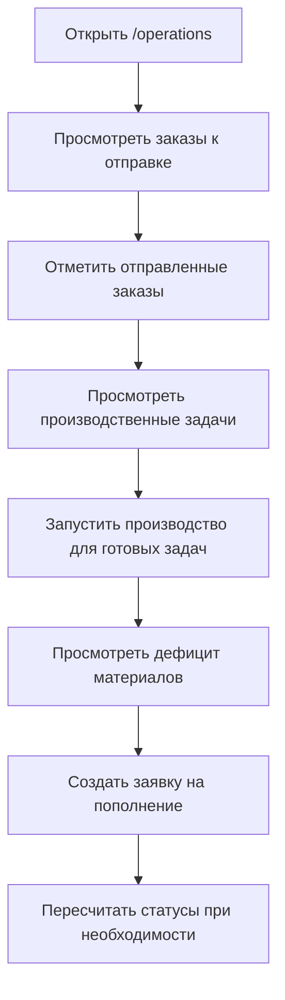
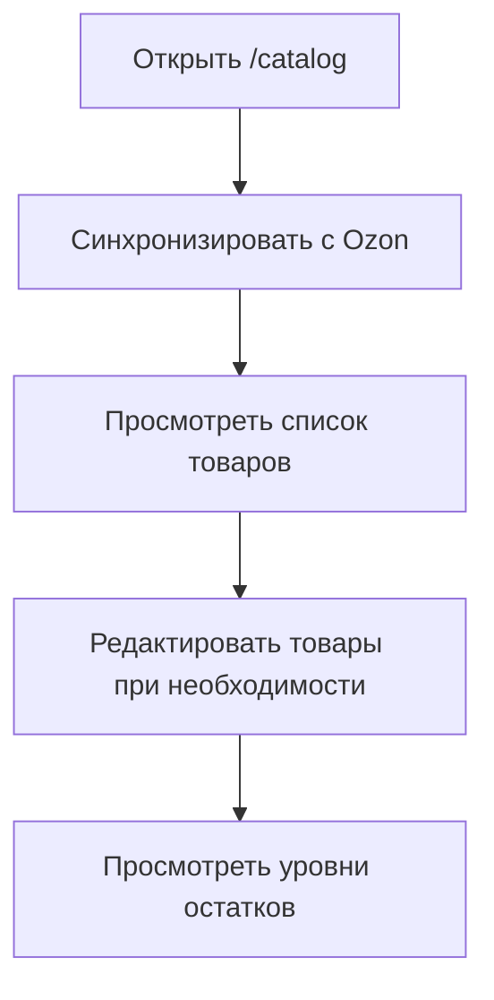
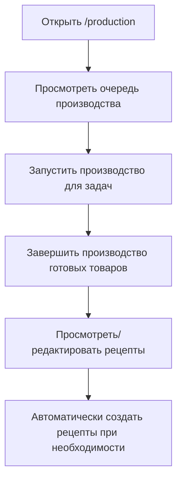
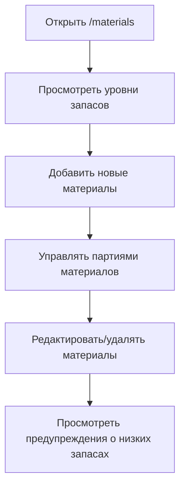

# 📚 GetoMerch - Комплексная документация проекта

## 🎯 Обзор проекта

**GetoMerch** - это комплексная система управления товарами, заказами, инвентарем и производством для маркетплейса Ozon. Приложение предоставляет полный цикл управления бизнес-процессами для продавцов на Ozon, от синхронизации каталога до управления производством и отгрузкой заказов.

## 🏗️ Архитектура проекта

### Технологический стек

- **Frontend**: Next.js 16 с App Router
- **Backend**: Next.js API routes + Supabase
- **База данных**: Supabase PostgreSQL
- **UI**: Tailwind CSS + Radix UI компоненты
- **Интеграции**: Ozon Seller API

### Структура проекта

```
/Users/kadimagomedov/Documents/GetoMerch/
├── app/                  # Основные страницы приложения
├── components/           # UI компоненты
├── lib/                  # Утилиты, сервисы, типы
├── scripts/              # SQL миграции
├── public/               # Статические файлы
└── styles/               # Глобальные стили
```

## 📋 Основные страницы и их функциональность

### 1. **Панель управления** (`/dashboard`)

**Назначение**: Главная страница с обзором всех ключевых метрик и статуса системы.

**Функциональность**:
- Отображение общего количества товаров
- Количество заказов в обработке
- Предупреждения об остатках (товары и материалы)
- Статус очереди производства
- Последние заказы с Ozon
- Обзор инвентаря и уровней остатков
- Статус всех компонентов системы

**Ключевые компоненты**:
- Карточки с метриками
- Таблица последних заказов
- Визуализация уровней инвентаря
- Статус подключения к Ozon API

### 2. **Операционный центр** (`/operations`)

**Назначение**: Центральный хаб для ежедневных операций - что нужно отправить, произвести и заказать.

**Функциональность**:

#### БЛОК 1: К отправке сегодня
- Список заказов с операционным статусом `READY_TO_SHIP`
- Информация о заказах: номер, клиент, сумма, товары
- Кнопка "Отправлено" для подтверждения отгрузки

#### БЛОК 2: Нужно произвести
- Агрегированные производственные потребности
- Товары, для которых есть все необходимые материалы
- Приоритезация задач (высокий/обычный)
- Кнопка "Запустить производство"

#### БЛОК 2.5: Не хватает материалов
- Заказы, заблокированные из-за недостатка материалов
- Красные предупреждения о невозможности производства
- Список товаров и заказов, ожидающих материалов

#### БЛОК 3: Чего не хватает
- Детализированный список дефицита материалов
- Показывает: материал, нужно, есть, дефицит
- Визуальные индикаторы дефицита

#### БЛОК 4: Заявка на пополнение
- Автоматически сгенерированный список материалов для заказа
- Приоритезация (СРОЧНО для критических материалов)
- Кнопка "Создать заявку на пополнение"

**Особенности**:
- Кнопка "Пересчитать статусы" для обновления операционных статусов
- Реальное время обновления данных
- Интеграция с API для получения дефицита материалов

### 3. **Каталог Ozon** (`/catalog`)

**Назначение**: Управление товарами на маркетплейсе Ozon.

**Функциональность**:
- Просмотр всех товаров из Ozon
- Синхронизация каталога с Ozon API
- Редактирование информации о товарах
- Просмотр остатков и статусов
- Поиск и фильтрация товаров

**Ключевые компоненты**:
- Кнопка "Синхронизировать с Ozon"
- Таблица товаров с изображениями, SKU, категориями, ценами
- Индикаторы низких остатков
- Диалог редактирования товара
- История синхронизации

### 4. **Управление производством** (`/production`)

**Назначение**: Управление очередью производства и рецептами.

**Функциональность**:

#### Вкладка "Очередь производства"
- Просмотр всех задач в очереди
- Статусы: ожидает, в процессе, завершено
- Приоритезация задач
- Информация о заказах и сроках
- Кнопки "Запустить производство" и "Завершить производство"

#### Вкладка "Рецепты"
- Управление рецептами производства
- Просмотр требуемых материалов для каждого товара
- Создание и редактирование рецептов
- Автоматическое создание рецептов
- Информация о времени производства

**Ключевые компоненты**:
- Таблица очереди производства
- Карточки рецептов с материалами
- Диалоги создания/редактирования рецептов
- Кнопки управления производством

### 5. **Управление материалами** (`/materials`)

**Назначение**: Отслеживание сырья и производственных материалов.

**Функциональность**:
- Просмотр всех материалов с атрибутами
- Управление партиями материалов (лотами)
- Отслеживание уровней запасов
- Предупреждения о низких запасах
- Создание, редактирование и удаление материалов
- Просмотр стоимости запасов

**Ключевые компоненты**:
- Таблица материалов с детальной информацией
- Диалоги управления материалами
- Визуализация уровней запасов (прогресс-бары)
- Управление партиями через диалог "Партии материалов"

### 6. **Заказы** (`/orders`)

**Назначение**: Управление заказами с Ozon.

**Функциональность**:
- Просмотр всех заказов
- Синхронизация заказов с Ozon
- Детальная информация по каждому заказу
- Статусы заказов и операционные статусы
- Поиск и фильтрация заказов

### 7. **Аналитика** (`/analytics`)

**Назначение**: Анализ продаж и бизнес-метрик.

**Функциональность**:
- Аналитика продаж
- Отчеты по инвентарю
- Тренды и прогнозы
- Визуализация данных

### 8. **Настройки** (`/settings`)

**Назначение**: Конфигурация системы и API.

**Функциональность**:
- Настройка Ozon API ключей
- Управление подключением к Supabase
- Тестирование API соединений
- Конфигурация системы

## 🔄 Пользовательский флоу

### 1. Ежедневная работа с операционным центром



### 2. Управление каталогом



### 3. Производственный процесс



### 4. Управление материалами



## 🎯 Основные бизнес-процессы

### 1. Синхронизация с Ozon

1. **Синхронизация каталога**: Импорт товаров с Ozon в локальную базу
2. **Синхронизация заказов**: Получение новых заказов с Ozon
3. **Синхронизация остатков**: Обновление уровней инвентаря

### 2. Обработка заказов

1. **Получение заказа**: Заказ попадает в систему через Ozon API
2. **Проверка остатков**: Система проверяет наличие товаров на складе
3. **Проверка материалов**: Для производственных товаров проверяется наличие материалов
4. **Назначение статуса**: Заказу присваивается операционный статус
5. **Отгрузка**: Готовые заказы отправляются клиентам

### 3. Производственный процесс

1. **Планирование**: Задачи производства попадают в очередь
2. **Проверка материалов**: Система проверяет наличие необходимых материалов
3. **Запуск производства**: Оператор запускает производство
4. **Завершение**: Готовые товары добавляются на склад
5. **Отгрузка**: Товары отправляются клиентам

### 4. Управление материалами

1. **Поступление**: Новые материалы добавляются в систему
2. **Хранение**: Материалы хранятся в партиях (лотах)
3. **Использование**: Материалы расходуются в производстве
4. **Пополнение**: Автоматическое создание заявок на пополнение

## 🔧 Техническая архитектура

### База данных (Supabase)

Основные таблицы:
- `products` - Товары
- `inventory` - Остатки на складе
- `orders` - Заказы
- `production_queue` - Очередь производства
- `recipes` - Рецепты производства
- `materials` - Материалы
- `material_lots` - Партии материалов
- `sync_log` - Логи синхронизации

### API Интеграции

1. **Ozon Seller API**: Синхронизация товаров, заказов, категорий
2. **Supabase API**: Работа с базой данных
3. **Внутренние API**: Операции с производством, материалами, заказами

### Основные сервисы

- **Fulfillment Service**: Управление выполнением заказов
- **Material Service**: Управление материалами и партиями
- **Operations Service**: Операционные процессы и статусы
- **Ozon Client**: Интеграция с Ozon API

## 📊 Статусы и их значения

### Операционные статусы заказов

- `READY_TO_SHIP`: Готов к отправке
- `WAITING_FOR_PRODUCTION`: Ожидает производства
- `IN_PRODUCTION`: В производстве
- `WAITING_FOR_MATERIALS`: Ожидает материалов
- `COMPLETED`: Завершен

### Статусы производства

- `pending`: Ожидает начала
- `in_progress`: В процессе
- `completed`: Завершено

### Статусы материалов

- `В наличии`: Достаточно материалов
- `Мало`: Низкий уровень запасов
- `Критично`: Очень низкий уровень, требует срочного пополнения

## 🎨 Дизайн и пользовательский опыт

### Навигация

- **Боковое меню**: Доступ ко всем разделам системы
- **Адаптивный дизайн**: Работа на десктопе и мобильных устройствах
- **Интуитивный интерфейс**: Карточки, таблицы, четкая иерархия информации

### Визуальные элементы

- **Цветовая схема**: Использование цветов для статусов (зеленый - хорошо, желтый - предупреждение, красный - критическое)
- **Иконки**: Интуитивно понятные иконки для действий
- **Прогресс-бары**: Визуализация уровней запасов
- **Бейджи**: Быстрая идентификация статусов

### Взаимодействие

- **Диалоги**: Для редактирования и создания элементов
- **Кнопки действий**: Четкие кнопки для основных операций
- **Фильтрация и поиск**: Быстрый доступ к нужной информации
- **Реальное время**: Автоматическое обновление данных

## 🚀 Особенности и преимущества

1. **Комплексное решение**: Все процессы в одном интерфейсе
2. **Автоматизация**: Многие процессы автоматизированы
3. **Интеграция с Ozon**: Прямая синхронизация с маркетплейсом
4. **Управление производством**: Полный контроль над производственными процессами
5. **Аналитика**: Возможность анализа бизнес-метрик
6. **Мобильная готовность**: Адаптивный дизайн для работы с мобильных устройств

## 📝 Рекомендации по использованию

### Для новых пользователей

1. Начните с **Панели управления** для общего обзора
2. Перейдите в **Операционный центр** для ежедневной работы
3. Настройте **Каталог** и синхронизируйте товары с Ozon
4. Добавьте необходимые **Материалы** для производства
5. Настройте **Рецепты** производства для ваших товаров

### Для опытных пользователей

1. Используйте **Операционный центр** как основную рабочую область
2. Регулярно проверяйте **дефицит материалов** и создавайте заявки на пополнение
3. Используйте **Аналитику** для принятия бизнес-решений
4. Настройте автоматические процессы для повышения эффективности

## 🔍 Решение проблем

### Частые проблемы и решения

1. **Не работают кнопки**: Проверьте подключение к интернету и Supabase
2. **Не синхронизируется с Ozon**: Проверьте настройки Ozon API ключей
3. **Некорректные статусы**: Используйте кнопку "Пересчитать статусы"
4. **Проблемы с производством**: Проверьте наличие материалов и рецептов

### Логи и отладка

- Проверяйте консоль браузера для технических ошибок
- Используйте раздел **Настройки** для тестирования API
- Просматривайте логи синхронизации в **Каталоге**

## 📚 Дополнительные ресурсы

- **QUICK_START.md**: Быстрый старт работы с проектом
- **WORKFLOW.md**: Руководство по workflow и Git
- **TROUBLESHOOTING_OPERATIONS.md**: Решение проблем с операциями

## 🤖 ИИ Ассистент

### Функциональность ИИ

В верхнем правом углу интерфейса добавлена кнопка ИИ (🧠), которая предоставляет краткую аналитическую сводку по текущему состоянию бизнеса.

### Как использовать

1. **Открытие сводки**: Нажмите на кнопку с иконкой мозга (🧠) в хедере
2. **Просмотр анализа**: В модальном окне отобразится краткая сводка с ключевыми инсайтами
3. **Обновление данных**: Нажмите "Обновить сводку" для получения актуальной информации

### Что анализирует ИИ

- **Заказы**: Общее количество, в обработке, выполненные, выручка
- **Инвентарь**: Уровни запасов, товары с низким запасом
- **Материалы**: Критические материалы, требующие пополнения
- **Производство**: Задачи в очереди производства

### Техническая реализация

- **OpenRouter API**: Используется для генерации сводки
- **Контекстные данные**: ИИ получает актуальные данные из базы
- **Резервный режим**: Если ИИ недоступен, показывается автоматически сгенерированная сводка

### Настройка

Для работы ИИ необходимо добавить в `.env` файле:

```env
OPENROUTER_API_KEY=ваш_ключ_openrouter
OPENROUTER_API_URL=https://openrouter.ai/api/v1/chat/completions
OPENROUTER_MODEL=mistralai/mistral-7b-instruct:free
```

### Пример сводки

```
📊 Сводка на 26 декабря 2025:

📦 В обработке 15 заказов на сумму 125,000 ₽
⚠️ 8 товаров с низким запасом требуют пополнения
🔴 3 критических материалов нужно заказать срочно
🏭 5 задач в очереди производства

💡 Рекомендации:
- Закажите материалы для производства
- Проверьте уровни запасов популярных товаров
- Обработайте заказы в очереди
```

## 🎯 Будущее развитие

Потенциальные направления развития:

1. **Автоматизация отгрузки**: Интеграция с курьерскими службами
2. **Расширенная аналитика**: Больше отчетов и дашбордов
3. **Мобильное приложение**: Нативные приложения для iOS и Android
4. **Мультимаркетплейс**: Поддержка других платформ (Wildberries, Яндекс.Маркет)
5. **Искусственный интеллект**: Прогнозирование спроса и оптимизация запасов

---

**GetoMerch** предоставляет полный контроль над бизнес-процессами для продавцов на Ozon, сочетая мощные возможности управления с интуитивно понятным интерфейсом. Система постоянно развивается и улучшается для удовлетворения потребностей растущего бизнеса.
