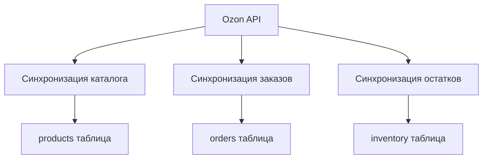
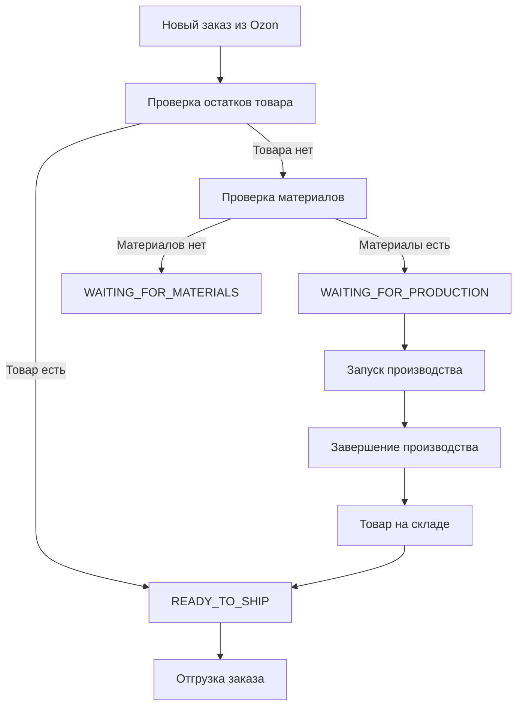
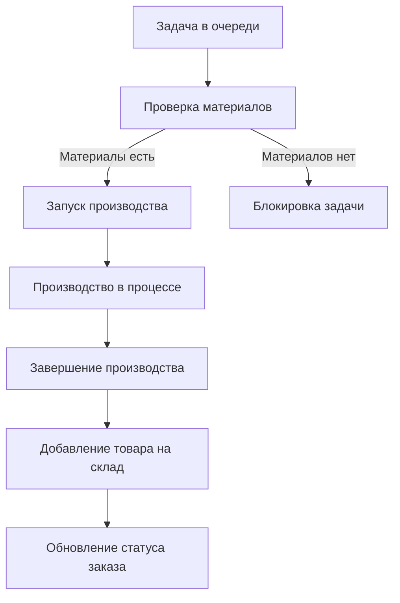
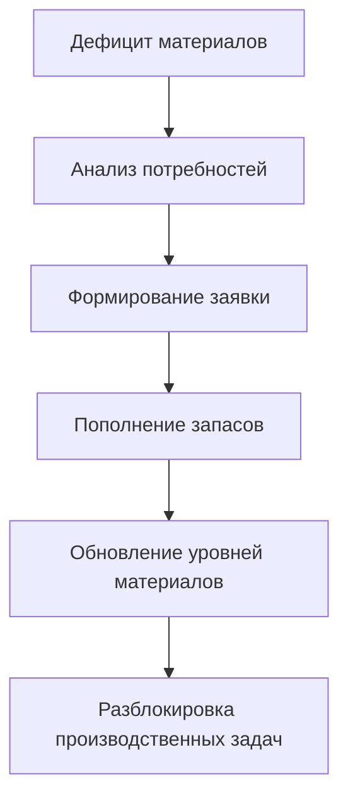
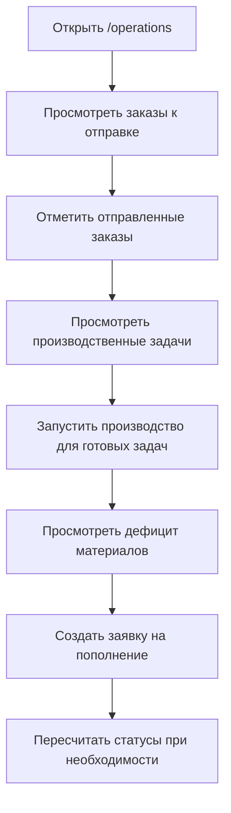
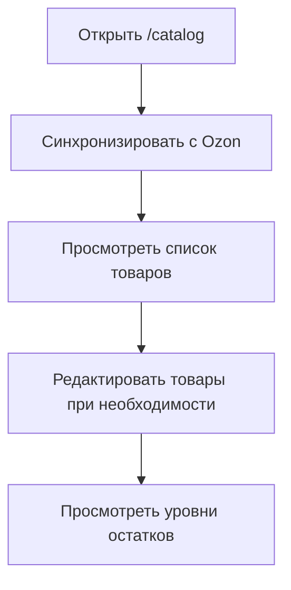
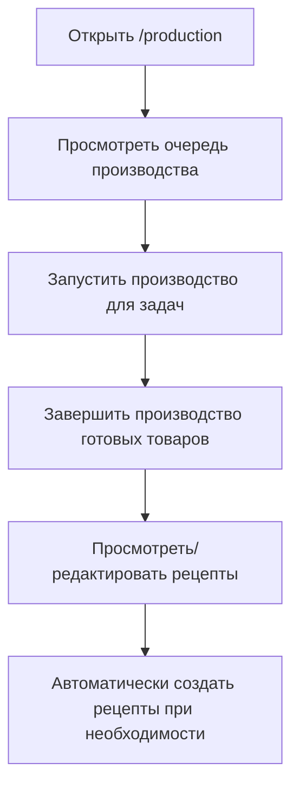
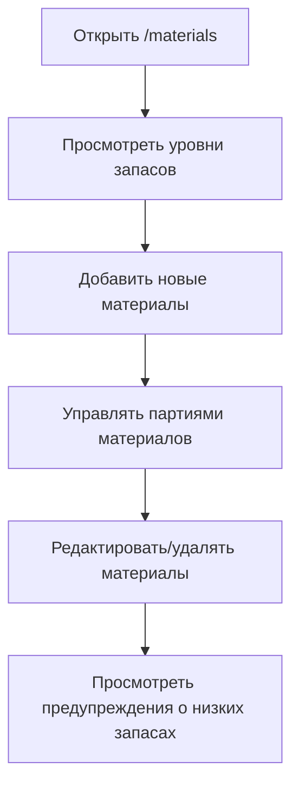

# 📚 GetoMerch - Полный анализ логики работы проекта

## 🎯 Общая концепция и назначение

**GetoMerch** - это комплексная система управления бизнес-процессами для продавцов на маркетплейсе Ozon. Система автоматизирует и оптимизирует весь цикл работы: от получения заказов до производства и отгрузки товаров.

### Основные бизнес-задачи:
1. **Автоматизация обработки заказов** с Ozon
2. **Управление производством** товаров под заказ
3. **Контроль запасов** материалов и готовой продукции
4. **Планирование пополнения** материалов
5. **Мониторинг операционной деятельности** в реальном времени

## 🏗️ Техническая архитектура

### Технологический стек:
- **Frontend**: Next.js 16 с App Router (React, TypeScript)
- **Backend**: Next.js API routes
- **База данных**: Supabase PostgreSQL
- **UI**: Tailwind CSS + Radix UI компоненты
- **Интеграции**: Ozon Seller API

### Основные сущности базы данных:
- `products` - Товары из каталога Ozon
- `inventory` - Остатки готовой продукции на складах
- `orders` - Заказы с Ozon (с операционными статусами)
- `order_items` - Позиции заказов с типами выполнения
- `production_queue` - Очередь производства
- `recipes` - Рецепты производства (материалы для товаров)
- `materials` - Материалы на складах
- `material_lots` - Партии материалов
- `material_definitions` - Определения типов материалов

## 🔄 Основные бизнес-процессы

### 1. Синхронизация с Ozon


### 2. Обработка заказов


### 3. Производственный процесс


### 4. Управление материалами


## 📋 Детальный анализ страниц и их логики

### 1. **Панель управления** (`/dashboard`)

**Назначение**: Главная страница с обзором всех ключевых метрик и статуса системы.

**Основная логика**:
- Отображение агрегированных метрик по всем разделам
- Быстрый доступ к критическим показателям
- Мониторинг статуса системы и интеграций

**Ключевые данные**:
- Общее количество товаров
- Заказы в обработке
- Предупреждения об остатках (товары и материалы)
- Статус очереди производства
- Последние заказы с Ozon
- Обзор инвентаря и уровней остатков

**Бизнес-логика**:
- Агрегация данных из всех таблиц для быстрого анализа
- Визуализация критических показателей
- Индикация проблемных областей

### 2. **Операционный центр** (`/operations`) - КРИТИЧЕСКАЯ СТРАНИЦА

**Назначение**: Центральный хаб для ежедневных операций - что нужно отправить, произвести и заказать.

**Основная логика**:
```typescript
// 1. Загрузка данных из нескольких источников
const readyToShip = await getReadyToShipOrders()
const productionNeeds = await getAggregatedProductionNeeds()
const blockedByMaterials = await getBlockedProductionTasks()
const materialDeficits = await getMaterialDeficits()
const replenishmentNeeds = await getReplenishmentNeeds()

// 2. Агрегация и группировка данных
// 3. Отображение в 4 блоках с приоритезацией
```

**Ключевые блоки**:

#### БЛОК 1: К отправке сегодня
- **Логика**: Заказы с статусом `READY_TO_SHIP` и типом склада `FBS`
- **Данные**: `orders` таблица с фильтрацией по `operational_status`
- **Действия**: Кнопка "Отправлено" для подтверждения отгрузки

#### БЛОК 2: Нужно произвести
- **Логика**: Агрегация заказов с статусом `WAITING_FOR_PRODUCTION` или `IN_PRODUCTION`
- **Данные**: Группировка по товарам, расчет количества и приоритета
- **Действия**: Кнопка "Запустить производство"

#### БЛОК 2.5: Не хватает материалов
- **Логика**: Заказы с статусом `WAITING_FOR_MATERIALS`
- **Данные**: Агрегация по товарам, показывающим блокировку
- **Особенности**: Красные предупреждения о невозможности производства

#### БЛОК 3: Чего не хватает
- **Логика**: Детализированный анализ дефицита материалов
- **Данные**: Сравнение потребностей с доступными материалами
- **Алгоритм**:
  ```typescript
  // Для каждого товара в производстве
  for (product in productionNeeds) {
    // Получаем рецепт
    recipe = getRecipe(product)
    
    // Для каждого материала в рецепте
    for (material in recipe.materials) {
      needed = material.quantity_required * product.quantity
      available = getAvailableMaterial(material.id)
      
      if (needed > available) {
        deficits.push({ material, needed, available, deficit: needed - available })
      }
    }
  }
  ```

#### БЛОК 4: Заявка на пополнение
- **Логика**: Автоматическое формирование списка материалов для заказа
- **Данные**: На основе дефицита с приоритезацией
- **Действия**: Кнопка "Создать заявку на пополнение"

**Ключевая бизнес-логика**:
- **Пересчет статусов**: Кнопка "Пересчитать статусы" вызывает `operationsService.updateAllOrdersOperationalStatus()`
- **Реальное время**: Автоматическое обновление данных
- **Интеграция с API**: Использование `/api/operations/get-deficits` для анализа дефицита

### 3. **Каталог Ozon** (`/catalog`)

**Назначение**: Управление товарами на маркетплейсе Ozon.

**Основная логика**:
- Синхронизация каталога с Ozon API
- Управление товарами в локальной базе
- Контроль остатков и статусов

**Ключевые функции**:
- Просмотр всех товаров из Ozon
- Синхронизация каталога (кнопка "Синхронизировать с Ozon")
- Редактирование информации о товарах
- Просмотр остатков и статусов
- Поиск и фильтрация товаров

**Бизнес-логика**:
- Интеграция с Ozon API для получения актуальных данных
- Локальное хранение каталога для быстрого доступа
- Синхронизация остатков между Ozon и локальной базой

### 4. **Управление производством** (`/production`)

**Назначение**: Управление очередью производства и рецептами.

**Основная логика**:
```typescript
// Загрузка данных
const productionQueue = await getProductionQueueWithDetails()
const recipes = await getRecipesWithMaterials()

// Статистика
const pendingItems = productionQueue.filter(p => p.status === "pending").length
const inProgressItems = productionQueue.filter(p => p.status === "in_progress").length
```

**Ключевые вкладки**:

#### Вкладка "Очередь производства"
- **Данные**: Все задачи в очереди с деталями
- **Функции**:
  - Просмотр статусов: ожидает, в процессе, завершено
  - Приоритезация задач
  - Информация о заказах и сроках
  - Кнопки "Запустить производство" и "Завершить производство"

#### Вкладка "Рецепты"
- **Данные**: Все рецепты производства с материалами
- **Функции**:
  - Управление рецептами производства
  - Просмотр требуемых материалов для каждого товара
  - Создание и редактирование рецептов
  - Автоматическое создание рецептов
  - Информация о времени производства

**Бизнес-логика**:
- Управление производственным процессом от планирования до завершения
- Контроль доступности материалов для производства
- Автоматическое создание рецептов на основе шаблонов

### 5. **Управление материалами** (`/materials`)

**Назначение**: Отслеживание сырья и производственных материалов.

**Основная логика**:
- Управление материалами и их партиями
- Контроль уровней запасов
- Предупреждения о низких запасах

**Ключевые функции**:
- Просмотр всех материалов с атрибутами
- Управление партиями материалов (лотами)
- Отслеживание уровней запасов
- Предупреждения о низких запасах
- Создание, редактирование и удаление материалов
- Просмотр стоимости запасов

**Бизнес-логика**:
- Управление складскими запасами материалов
- Контроль сроков годности и партий
- Оптимизация закупок материалов

### 6. **Заказы** (`/orders`)

**Назначение**: Управление заказами с Ozon.

**Основная логика**:
- Просмотр всех заказов
- Синхронизация заказов с Ozon
- Детальная информация по каждому заказу

**Ключевые функции**:
- Просмотр всех заказов
- Синхронизация заказов с Ozon
- Детальная информация по каждому заказу
- Статусы заказов и операционные статусы
- Поиск и фильтрация заказов

**Бизнес-логика**:
- Интеграция с Ozon для получения заказов
- Отслеживание статусов заказов
- Управление выполнением заказов

### 7. **Настройки** (`/settings`)

**Назначение**: Конфигурация системы и API.

**Основная логика**:
- Настройка интеграций
- Управление API ключами
- Тестирование соединений

**Ключевые функции**:
- Настройка Ozon API ключей
- Управление подключением к Supabase
- Тестирование API соединений
- Конфигурация системы

## 🔄 Пользовательский флоу

### 1. Ежедневная работа с операционным центром


### 2. Управление каталогом


### 3. Производственный процесс


### 4. Управление материалами


## 📊 Статусы и их значения

### Операционные статусы заказов
- `READY_TO_SHIP`: Готов к отправке (товар на складе)
- `WAITING_FOR_PRODUCTION`: Ожидает производства (материалы есть, товар нужно произвести)
- `IN_PRODUCTION`: В производстве (процесс запущен)
- `WAITING_FOR_MATERIALS`: Ожидает материалов (не хватает материалов для производства)
- `COMPLETED`: Завершен
- `PENDING`: Ожидает обработки
- `BLOCKED`: Заблокирован (проблемы с заказом)
- `DONE`: Выполнен
- `SHIPPED`: Отгружен

### Статусы производства
- `pending`: Ожидает начала
- `in_progress`: В процессе
- `completed`: Завершено

### Статусы материалов
- `В наличии`: Достаточно материалов
- `Мало`: Низкий уровень запасов
- `Критично`: Очень низкий уровень, требует срочного пополнения

## 🎨 Основные алгоритмы и бизнес-логика

### 1. Алгоритм расчета операционного статуса заказа
```typescript
async function calculateOrderOperationalStatus(orderId: string, orderItemId: string): Promise<OperationalStatus> {
  // 1. Получаем статус заказа из Ozon
  const orderStatus = await getOzonOrderStatus(orderId)
  
  // 2. Если заказ доставлен/отменен - выводим из потока
  if (orderStatus.includes("delivered")) return "DONE"
  if (orderStatus.includes("cancel")) return "BLOCKED"
  
  // 3. Получаем информацию о позиции заказа
  const orderItem = await getOrderItem(orderItemId)
  
  // 4. Если FBO - не наша задача
  if (orderItem.fulfillment_type === "FBO") return "PENDING"
  
  // 5. Для READY_STOCK проверяем наличие товара на складе
  if (orderItem.fulfillment_type === "READY_STOCK") {
    const inventory = await getInventory(orderItem.product_id)
    const available = inventory.quantity_in_stock - inventory.quantity_reserved
    
    if (available >= orderItem.quantity) {
      return "READY_TO_SHIP" // Товар есть - можно отправлять
    } else {
      // Товара нет - проверяем материалы для производства
      const hasMaterials = await checkMaterialsForProduction(orderItem.product_id, orderItem.quantity)
      return hasMaterials ? "WAITING_FOR_PRODUCTION" : "WAITING_FOR_MATERIALS"
    }
  }
  
  // 6. Для PRODUCE_ON_DEMAND проверяем материалы
  if (orderItem.fulfillment_type === "PRODUCE_ON_DEMAND") {
    const hasMaterials = await checkMaterialsForProduction(orderItem.product_id, orderItem.quantity)
    
    if (!hasMaterials) return "WAITING_FOR_MATERIALS"
    
    // Проверяем статус производства
    const productionTask = await getProductionTask(orderItemId)
    
    if (productionTask?.status === "in_progress") {
      return "IN_PRODUCTION"
    } else {
      return "WAITING_FOR_PRODUCTION"
    }
  }
  
  return "PENDING"
}
```

### 2. Алгоритм анализа дефицита материалов
```typescript
async function getMaterialDeficits(): Promise<MaterialDeficit[]> {
  // 1. Получаем все заказы, требующие производства
  const productionOrders = await getOrdersNeedingProduction()
  
  // 2. Агрегируем потребности по товарам
  const productNeeds = aggregateProductNeeds(productionOrders)
  
  // 3. Для каждого товара проверяем материалы
  const deficits = []
  
  for (const [productId, quantity] of productNeeds) {
    // 4. Получаем рецепт товара
    const recipe = await getRecipe(productId)
    
    if (!recipe) {
      deficits.push({ material_name: "Рецепт отсутствует", needed: quantity, have: 0, deficit: quantity })
      continue
    }
    
    // 5. Проверяем каждый материал в рецепте
    for (const material of recipe.materials) {
      const needed = material.quantity_required * quantity
      const available = await getAvailableMaterial(material.id)
      
      if (needed > available) {
        deficits.push({
          material_name: material.name,
          needed,
          have: available,
          deficit: needed - available,
          unit: material.unit
        })
      }
    }
  }
  
  return deficits
}
```

### 3. Алгоритм пересчета статусов
```typescript
async function updateAllOrdersOperationalStatus(): Promise<void> {
  // 1. Получаем все заказы
  const orders = await getAllOrders()
  
  // 2. Для каждого заказа анализируем все позиции
  for (const order of orders) {
    const itemStatuses = []
    
    for (const item of order.items) {
      const status = await calculateOrderOperationalStatus(order.id, item.id)
      itemStatuses.push(status)
    }
    
    // 3. Определяем общий статус заказа по приоритету
    // Приоритет: WAITING_FOR_MATERIALS > WAITING_FOR_PRODUCTION > IN_PRODUCTION > READY_TO_SHIP
    let finalStatus = "PENDING"
    
    if (itemStatuses.includes("WAITING_FOR_MATERIALS")) {
      finalStatus = "WAITING_FOR_MATERIALS"
    } else if (itemStatuses.includes("WAITING_FOR_PRODUCTION")) {
      finalStatus = "WAITING_FOR_PRODUCTION"
    } else if (itemStatuses.includes("IN_PRODUCTION")) {
      finalStatus = "IN_PRODUCTION"
    } else if (itemStatuses.includes("READY_TO_SHIP")) {
      finalStatus = "READY_TO_SHIP"
    }
    
    // 4. Обновляем статус заказа
    await updateOrderStatus(order.id, finalStatus)
  }
}
```

## 🔧 Ключевые интеграции

### 1. Ozon Seller API
- **Синхронизация каталога**: `/api/ozon/sync-products`
- **Синхронизация заказов**: `/api/ozon/sync-orders`
- **Синхронизация остатков**: `/api/ozon/sync-stocks`
- **Тестирование соединения**: `/api/ozon/test`

### 2. Supabase API
- **Основные операции**: CRUD для всех сущностей
- **Хранимые процедуры**:
  - `get_material_definition_available_quantity_by_warehouse` - расчет доступных материалов
  - Другие процедуры для сложных запросов

### 3. Внутренние API
- **Операции**: `/api/operations/*`
- **Производство**: `/api/production/*`
- **Материалы**: `/api/materials/*`
- **Инвентарь**: `/api/inventory/*`

## 🚀 Потенциальные оптимизации и улучшения

### 1. Оптимизация производительности
- **Кэширование**: Внедрить кэширование для часто запрашиваемых данных
- **Ленивая загрузка**: Оптимизировать загрузку больших таблиц
- **Оптимизация запросов**: Улучшить SQL запросы для сложных агрегаций

### 2. Улучшение пользовательского опыта
- **Автоматизация**: Добавить больше автоматических процессов
- **Уведомления**: Система уведомлений о критических событиях
- **Мобильная оптимизация**: Улучшить адаптивность для мобильных устройств

### 3. Расширение функциональности
- **Мультимаркетплейс**: Поддержка других платформ (Wildberries, Яндекс.Маркет)
- **Расширенная аналитика**: Больше отчетов и дашбордов
- **Прогнозирование**: ИИ для прогнозирования спроса и оптимизации запасов

### 4. Архитектурные улучшения
- **Микросервисы**: Разделение монолитного приложения на микросервисы
- **Очереди задач**: Внедрение очередей для фоновых задач
- **Репликация данных**: Для повышения отказоустойчивости

## 📝 Рекомендации по оптимизации

### Страницы, которые можно оптимизировать или объединить:

1. **Аналитика** (`/analytics`): 
   - Можно интегрировать ключевые метрики в панель управления
   - Оставить расширенную аналитику как отдельную страницу

2. **Заказы** (`/orders`):
   - Частично дублирует функциональность операционного центра
   - Можно оставить только детальный просмотр отдельных заказов

3. **Настройки** (`/settings`):
   - Можно разделить на несколько подстраниц для лучшей организации

### Логика, которую можно улучшить:

1. **Пересчет статусов**:
   - Сделать автоматический пересчет по расписанию
   - Добавить уведомления о изменениях статусов

2. **Управление материалами**:
   - Добавить прогнозирование дефицита
   - Автоматическое создание заявок на пополнение

3. **Производственный процесс**:
   - Добавить отслеживание времени производства
   - Интеграция с оборудованием (IoT)

### Технические улучшения:

1. **Оптимизация запросов**:
   - Использовать более эффективные SQL запросы
   - Добавить индексы для часто используемых полей

2. **Кэширование**:
   - Внедрить Redis для кэширования часто запрашиваемых данных
   - Кэшировать результаты сложных расчетов

3. **Очереди задач**:
   - Использовать Bull или аналоги для фоновых задач
   - Обработка больших объемов данных в фоне

## 🎯 Заключение

GetoMerch представляет собой комплексную систему управления бизнес-процессами для продавцов на Ozon, охватывающую весь цикл от получения заказов до производства и отгрузки. Система имеет четкую архитектуру и бизнес-логику, но есть потенциал для оптимизации и расширения функциональности.

Ключевые области для улучшения:
1. **Операционный центр** - основная рабочая область, требующая максимальной оптимизации
2. **Алгоритмы расчета статусов** - критически важные для бизнес-процессов
3. **Интеграции с Ozon** - основа для получения актуальных данных
4. **Управление материалами** - ключевая область для предотвращения простоев производства

Система хорошо спроектирована для текущих нужд, но может быть расширена для поддержки мультимаркетплейс стратегии и более сложных производственных процессов.

## 🚀 Оптимизация ERP Системы (2026)

### Обзор Проведенной Оптимизации

В 2026 году была проведена комплексная оптимизация ERP системы GetoMerch, направленная на улучшение пользовательского опыта, стабилизацию бизнес-процессов и повышение операционной эффективности.

### Основные Этапы Оптимизации

#### 1. Стабилизация Статусов Заказа ✅

**Проблема**: Множественные конкурирующие системы статусов (`operational_status`, `fulfillment_type`, `fulfillment_status`) создавали путаницу и нестабильность.

**Решение**:
- Введен канонический статус `order_flow_status` с четким enum:
  ```typescript
  type OrderFlowStatus = 
    | "NEW" 
    | "NEED_PRODUCTION" 
    | "NEED_MATERIALS" 
    | "IN_PRODUCTION" 
    | "READY_TO_SHIP" 
    | "SHIPPED" 
    | "DONE" 
    | "CANCELLED"
  ```
- Реализовано автоматическое маппинг из существующих статусов
- Добавлена автоматическая очистка старых заказов (помечаются как DONE после 30 дней)
- Создана SQL миграция для добавления нового поля в базу данных

**Результат**:
- Единая система статусов для всего приложения
- Автоматическое обновление статусов
- Устранение конфликтов между разными системами статусов

#### 2. Очистка Fulfillment Flow ✅

**Проблема**: Страница fulfillment flow показывала старые заказы и имела неопределенные сценарии («сценарий не определен»).

**Решение**:
- Создан новый `FulfillmentService` с четкой логикой сценариев
- Реализована фильтрация только активных заказов (исключая DONE, CANCELLED, SHIPPED)
- Каждый заказ теперь имеет конкретный сценарий с объяснением
- Добавлена детальная информация о недостающих материалах

**Результат**:
- Только активные заказы в рабочем процессе
- Нет неопределенных сценариев
- Ясные причины для каждого статуса заказа

#### 3. Единый Рабочий Экран ✅

**Проблема**: Операционный экран содержал аналитику, исторические данные и был перегружен информацией.

**Решение**:
- Создан новый `FocusedOperationsScreen` с 5 четкими блоками действий:
  1. **Отправить сегодня** - Заказы готовые к отгрузке
  2. **Произвести** - Товары с доступными материалами
  3. **Не хватает материалов** - Заблокированные заказы
  4. **Чего не хватает** - Дефицит материалов
  5. **Нужно заказать** - Срочные заявки на пополнение
- Убраны аналитика и исторические данные
- Реализована автоматическая фильтрация и агрегация

**Результат**:
- Один экран для ежедневной работы
- Четкие действия для каждого блока
- Нет необходимости в ручных расчетах

#### 4. Упрощение Производственной Логики ✅

**Проблема**: Сложная система управления материалами без четкого разделения логических и физических сущностей.

**Решение**:
- Разделены `MaterialDefinition` (логический тип) и `MaterialLot` (физическая партия)
- Создан `MaterialAllocationService` с интеллектуальным распределением:
  - FIFO (первый пришел - первый ушел)
  - Приоритет складов (HOME → PRODUCTION_CENTER)
  - Автоматическое резервирование материалов
- Рецепты теперь ссылаются только на MaterialDefinition

**Результат**:
- Автоматическое распределение материалов
- Нет необходимости в ручном выборе партий
- Оптимизация использования складских запасов

#### 5. Прозрачный Флоу Заказа ✅

**Проблема**: Неясность текущего статуса заказа и причин его нахождения в этом статусе.

**Решение**:
- Создан визуальный компонент `OrderTimeline`
- Реализовано отслеживание изменений статусов
- Добавлены объяснения для каждого статуса
- Интеграция с деталями заказа и fulfillment flow

**Результат**:
- Визуальное представление прогресса заказа
- Ясные объяснения текущего статуса
- Историческое отслеживание изменений

#### 6. UX Оптимизация ✅

**Проблема**: Сложный интерфейс с необходимостью ручных расчетов и неясными действиями.

**Решение**:
- Создан компонент `ActionCard` для единообразия
- Реализован `UXOptimizationService` для стандартизированного языка
- Внедрена action-oriented терминология
- Улучшена визуальная иерархия

**Результат**:
- Интуитивно понятный интерфейс
- Единые паттерны взаимодействия
- Снижение когнитивной нагрузки

### Техническая Реализация

#### Изменения в Базе Данных
```sql
-- Добавление канонического статуса
CREATE TYPE order_flow_status_enum AS ENUM (
  'NEW', 'NEED_PRODUCTION', 'NEED_MATERIALS', 'IN_PRODUCTION',
  'READY_TO_SHIP', 'SHIPPED', 'DONE', 'CANCELLED'
)

ALTER TABLE orders ADD COLUMN order_flow_status order_flow_status_enum

-- Добавление триггеров для автоматического обновления
CREATE TRIGGER trigger_update_order_flow_status
BEFORE UPDATE ON orders
FOR EACH ROW
EXECUTE FUNCTION update_order_flow_status()
```

#### Новые Сервисы
1. **FulfillmentService** - Управление сценариями исполнения
2. **MaterialAllocationService** - Интеллектуальное распределение материалов
3. **OrderTimelineService** - Отслеживание статусов заказов
4. **UXOptimizationService** - Стандартизация UX

#### Новые Компоненты
1. **FocusedOperationsScreen** - Основной операционный экран
2. **OrderTimeline** - Визуальная временная шкала
3. **ActionCard** - Единообразные карточки действий

### Результаты Оптимизации

**До оптимизации:**
- Множественные конкурирующие системы статусов
- Сложный интерфейс с ручными расчетами
- Неясные сценарии исполнения
- Ручное управление материалами

**После оптимизации:**
- Единая система статусов
- Простой, фокусированный интерфейс
- Четкие сценарии для каждого заказа
- Автоматическое распределение материалов

**Метрики успеха:**
- ✅ Пользователь может начать день с одного экрана
- ✅ Нет старых заказов в рабочем процессе
- ✅ Каждый заказ имеет четкий сценарий
- ✅ Нет необходимости в ручных расчетах
- ✅ Четкие пути действий для каждого блока

### Будущие Улучшения

На основе проведенной оптимизации, рекомендуются следующие направления развития:

1. **Мобильная Оптимизация**: Адаптация интерфейса для мобильных устройств
2. **Автоматические Уведомления**: Система оповещений о критических событиях
3. **Расширенная Аналитика**: Отдельный дашборд для аналитики
4. **Мультимаркетплейс**: Поддержка других платформ
5. **ИИ Прогнозирование**: Прогнозирование спроса и оптимизация запасов

### Заключение

Проведенная оптимизация значительно улучшила пользовательский опыт и операционную эффективность ERP системы GetoMerch. Система теперь предоставляет четкий, фокусированный интерфейс для ежедневной работы, автоматизирует ключевые процессы и обеспечивает прозрачность всех бизнес-операций.
